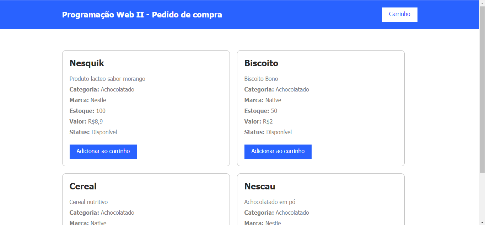
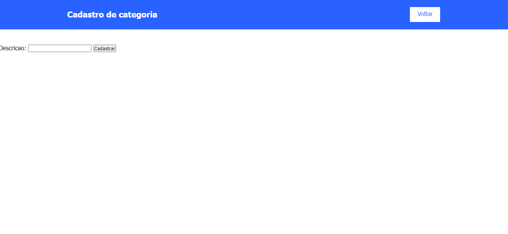

[CADECOMMERCE](#cadecommerce)

[Descrição:](#descri%C3%A7%C3%A3o)

[Introdução:](#introdu%C3%A7%C3%A3o)

[Funcionalidades:](#funcionalidades)

[Tecnologias Utilizadas:](#tecnologias-utilizadas)

[Estrutura do Projeto:](#estrutura-do-projeto)

[Métodos PHP Utilizados](#m%C3%A9todos-php-utilizados)

[Exemplos Auxiliares:](#exemplos-auxiliares)

[Comentários no Código:](#coment%C3%A1rios-no-c%C3%B3digo)

[Fontes Consultadas](#fontes-consultadas)

[Autor](#autor)

# CADECOMMERCE

CADECOMMERCE é um sistema de e-commerce simples desenvolvido em PHP. Este repositório contém todos os arquivos necessários para a criação de um carrinho de compras, cadastro de produtos, 
categorias e marcas, e a visualização de pedidos.

## Descrição:
CADECOMMERCE é uma aplicação web para a gestão de um comércio eletrônico, permitindo a administração de produtos, categorias e marcas, bem como a simulação de compras através de um carrinho de compras. A aplicação foi desenvolvida utilizando PHP e MySQL, com uma interface simples em HTML e CSS.

## Introdução:
Este projeto tem como objetivo fornecer uma base para o desenvolvimento de uma aplicação de e-commerce, demonstrando o uso de PHP para manipulação de dados e interação com um banco de dados MySQL. É uma excelente ferramenta de aprendizado para desenvolvedores iniciantes e intermediários que desejam entender como construir um sistema de compras online.

## Funcionalidades:

`Cadastro de Produtos:` Permite o cadastro de novos produtos, especificando nome, descrição, estoque, preço, categoria e marca.

`Cadastro de Categorias:` Permite o cadastro de novas categorias de produtos.

`Cadastro de Marcas:` Permite o cadastro de novas marcas de produtos.

`Carrinho de Compras:` Permite adicionar, remover e visualizar produtos no carrinho de compras.

`Visualização de Pedidos:` Exibe um resumo dos produtos adicionados ao carrinho, simulando um pedido.

## Tecnologias Utilizadas:
PHP

MySQL

HTML

CSS

JavaScript (jQuery)

## Estrutura do Projeto:
O projeto está organizado da seguinte forma:

`Pasta controller`
Esta pasta contém os arquivos responsáveis pelo controle das operações do carrinho e dos produtos.

⊳ carrinho-add.php

⊳ carrinho-busca.php

⊳ carrinho-remover.php

⊳ conexao.php

⊳ produtos-busca.php

⊳ produtos-pedido.php

⊳ produtos-resumo.php

Pasta Geral `CADECOMMERCE`
Esta pasta contém os arquivos principais do sistema.

⊳ carrinho.php

⊳ categoria.php

⊳ index.php

⊳ insere-categoria.php

⊳ insere-marca.php

⊳ insere-produto.php

⊳ marca.php

⊳ pedido.php

⊳ produtos.php

## Métodos PHP Utilizados:

`mysqli_connect`
Estabelece uma conexão com um servidor MySQL.

`mysqli_query`
Executa uma consulta no banco de dados.

`mysqli_fetch_assoc`
Retorna uma linha de resultado como uma matriz associativa.

`mysqli_close`
Fecha a conexão com o banco de dados.

## Exemplos Auxiliares:

_Cadastro de Categoria_

`categoria.php:` Formulário para cadastro de categorias.

`insere-categoria.php:` Código PHP para inserção de uma nova categoria no banco de dados.

_Cadastro de Marca_

`marca.php:` Formulário para cadastro de marcas.

`insere-marca.php:` Código PHP para inserção de uma nova marca no banco de dados.

_Cadastro de Produto_

`produtos.php:` Formulário para cadastro de produtos.

`insere-produto.php:` Código PHP para inserção de um novo produto no banco de dados.

## Comentários no Código:

Todos os arquivos PHP neste projeto contêm comentários explicando as funcionalidades implementadas. Esses comentários ajudam na compreensão do fluxo do código e na manutenção futura.

## Fontes Consultadas:

[alura](https://www.alura.com.br/artigos/escrever-bom-readme?utm_term=&utm_campaign=&utm_source=adwords&utm_medium=ppc&hsa_acc=7964138385&hsa_cam=20946398532&hsa_grp=153091871930&hsa_ad=688089973825&hsa_src=g&hsa_tgt=dsa-2258482177123&hsa_kw=&hsa_mt=&hsa_net=adwords&hsa_ver=3&gad_source=1&gclid=Cj0KCQjwncWvBhD_ARIsAEb2HW8ijk7NVhpuiVanaYEGFFOvZkBpjlnMcjF5Wcw-slwIVdYTzACJOG4aAiywEALw_wcB).  

[Documentação PHP](https://www.php.net/manual/pt_BR/).

[Documentação MySQL](https://dev.mysql.com/doc/).

[jQuery Documentation](https://jquery.com/).

## Autor:
Thalyta das Neves Ferreira 3°A
